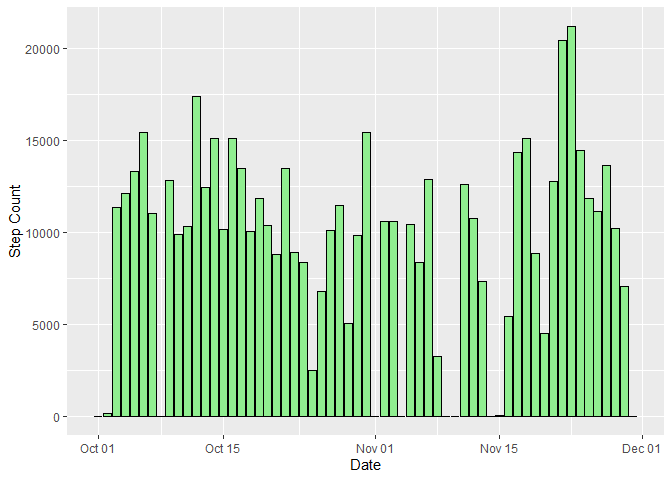
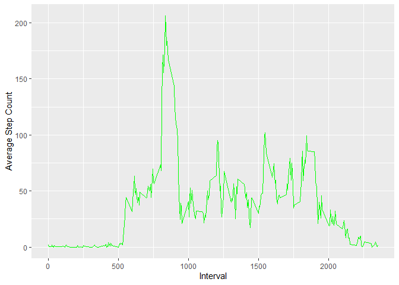
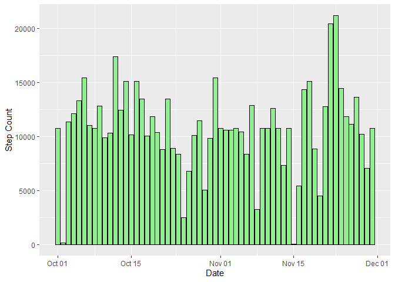
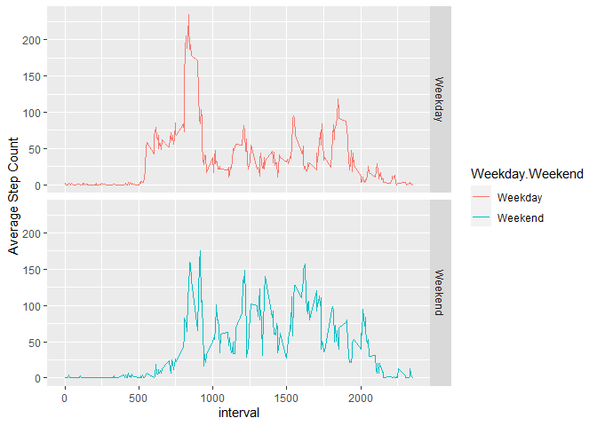

Done by: Vladimir Mijatovic
=========================================

Date of creation:

```r
print(Sys.time())
```

```
## [1] "2021-01-25 16:10:40 CET"
```


=========================================

## First we will load the data from URL into /_data/ folder a variable:


```r
dataFile <- download.file("https://d396qusza40orc.cloudfront.net/repdata%2Fdata%2Factivity.zip", "./_data/Activity.zip")

#see if file exists already  
if(!file.exists("./_data/Activity.csv")){
        unzip("./_data/activity.zip")
}
```

Let's load libraries needed:

```r
library(tidyverse)
```

```
## -- Attaching packages --------------------------------------- tidyverse 1.3.0 --
```

```
## v ggplot2 3.3.3     v purrr   0.3.4
## v tibble  3.0.4     v dplyr   1.0.2
## v tidyr   1.1.2     v stringr 1.4.0
## v readr   1.4.0     v forcats 0.5.0
```

```
## -- Conflicts ------------------------------------------ tidyverse_conflicts() --
## x dplyr::filter() masks stats::filter()
## x dplyr::lag()    masks stats::lag()
```

```r
library(dplyr)
library(ggplot2)
```


Then read from the locally stored file into data frame:


```r
activityDF <- read.csv("./_data/activity.csv", stringsAsFactors = FALSE)

str(activityDF)
```

```
## 'data.frame':	17568 obs. of  3 variables:
##  $ steps   : int  NA NA NA NA NA NA NA NA NA NA ...
##  $ date    : chr  "2012-10-01" "2012-10-01" "2012-10-01" "2012-10-01" ...
##  $ interval: int  0 5 10 15 20 25 30 35 40 45 ...
```

Transform data into better format


```r
#transform date
activityDF$date <- as.POSIXct(activityDF$date, "%Y-%m-%d", tz="CET")
str(activityDF)
```

```
## 'data.frame':	17568 obs. of  3 variables:
##  $ steps   : int  NA NA NA NA NA NA NA NA NA NA ...
##  $ date    : POSIXct, format: "2012-10-01" "2012-10-01" ...
##  $ interval: int  0 5 10 15 20 25 30 35 40 45 ...
```

```r
summary(activityDF)
```

```
##      steps             date                        interval     
##  Min.   :  0.00   Min.   :2012-10-01 00:00:00   Min.   :   0.0  
##  1st Qu.:  0.00   1st Qu.:2012-10-16 00:00:00   1st Qu.: 588.8  
##  Median :  0.00   Median :2012-10-31 00:00:00   Median :1177.5  
##  Mean   : 37.38   Mean   :2012-10-30 23:32:27   Mean   :1177.5  
##  3rd Qu.: 12.00   3rd Qu.:2012-11-15 00:00:00   3rd Qu.:1766.2  
##  Max.   :806.00   Max.   :2012-11-30 00:00:00   Max.   :2355.0  
##  NA's   :2304
```

```r
#remove NAs (prepare clean df if needed)

activityDF_clean <- activityDF[!is.na(activityDF$steps), ]
summary(activityDF_clean)
```

```
##      steps             date                        interval     
##  Min.   :  0.00   Min.   :2012-10-02 00:00:00   Min.   :   0.0  
##  1st Qu.:  0.00   1st Qu.:2012-10-16 00:00:00   1st Qu.: 588.8  
##  Median :  0.00   Median :2012-10-29 00:00:00   Median :1177.5  
##  Mean   : 37.38   Mean   :2012-10-30 16:43:01   Mean   :1177.5  
##  3rd Qu.: 12.00   3rd Qu.:2012-11-16 00:00:00   3rd Qu.:1766.2  
##  Max.   :806.00   Max.   :2012-11-29 00:00:00   Max.   :2355.0
```

calculate total number of steps per day:


```r
steps_per_day <- activityDF %>% 
        group_by(date) %>% 
        summarise(total.steps = sum(steps, na.rm = TRUE))
```

```
## `summarise()` ungrouping output (override with `.groups` argument)
```

```r
ggplot(data = steps_per_day,aes(x = date, y = total.steps)) +
        geom_bar(stat = "identity", color = "Black", fill = "LightGreen") +
        xlab("Date") +
        ylab("Step Count") +
        theme_gray()
```

<!-- -->

```r
steps_mean <- round(mean(steps_per_day$total.steps), 1)

steps_median <- median(steps_per_day$total.steps)


print(paste("mean number of steps per day is:", steps_mean))
```

```
## [1] "mean number of steps per day is: 9354.2"
```

```r
print(paste("Average number of steps is:", steps_median))
```

```
## [1] "Average number of steps is: 10395"
```


## What is the average daily activity pattern?


```r
steps_per_timeslot <- activityDF %>% 
        group_by(interval) %>% 
        summarise(average.steps = mean(steps, na.rm = TRUE))
```

```
## `summarise()` ungrouping output (override with `.groups` argument)
```

```r
ggplot(data = steps_per_timeslot,aes(x = interval, y = average.steps)) +
        geom_line(color = "Green")+
        xlab("Interval") +
        ylab("Average Step Count") 
```

<!-- -->

```r
max_interval <- steps_per_timeslot[which.max(steps_per_timeslot$average.steps), ]
print(paste("The interval with maximum number of steps(averaged) is at:", max_interval[1]))
```

```
## [1] "The interval with maximum number of steps(averaged) is at: 835"
```


Now let's deal with NAs


```r
total_incomplete_rows <- sum(!complete.cases(activityDF))
print(paste("Total number of incomplete rows:", total_incomplete_rows))
```

```
## [1] "Total number of incomplete rows: 2304"
```


## Strategy for filling the missing values for steps: Impute with mean value


```r
#fill NAs with mean value for that day

#na_activityDF <- activityDF[is.na(activityDF$steps), ] 
activityDF_imputed <- activityDF
activityDF_imputed[is.na(activityDF_imputed$steps), ]$steps <- mean(activityDF_imputed$steps, na.rm = TRUE)
```


Now let's create histogram of the total numbe of steps taken each day:


```r
steps_per_day_imputed <- activityDF_imputed %>% 
        group_by(date) %>% 
        summarise(total.steps = sum(steps, na.rm = TRUE))
```

```
## `summarise()` ungrouping output (override with `.groups` argument)
```

```r
ggplot(data = steps_per_day_imputed,aes(x = date, y = total.steps)) +
        geom_bar(stat = "identity", color = "Black", fill = "LightGreen") +
        xlab("Date") +
        ylab("Step Count") +
        theme_gray()
```

<!-- -->

```r
mean_imputed <- round(mean(steps_per_day_imputed$total.steps), 1)

median_imputed <- median(steps_per_day_imputed$total.steps)

print(paste("Mean number of steps (when imputed) is:", mean_imputed))
```

```
## [1] "Mean number of steps (when imputed) is: 10766.2"
```

```r
print(paste("Median number of steps (when imputed) is:", median_imputed))
```

```
## [1] "Median number of steps (when imputed) is: 10766.1886792453"
```

surely **it is different**, the dates where data is imputed show higher number of steps.  


# Are there differences in activity patterns between weekdays and weekends?

Let's create new variable with weekdays and weekends


```r
#let's add column Weekday.Weekend to determine what is it
activityDF$Weekday.Weekend <- ifelse(weekdays(activityDF$date) %in% c("Monday","Tuesday","Wednesday","Thursday","Friday"), "Weekday", "Weekend")

levels(activityDF$Weekday.Weekend) <-c("Weekday", "Weekend")

activityDF <- activityDF %>% 
        group_by(Weekday.Weekend, interval)  %>% 
        summarise(average.steps = mean(steps, na.rm = TRUE))
```

```
## `summarise()` regrouping output by 'Weekday.Weekend' (override with `.groups` argument)
```

```r
ggplot(data = activityDF,aes(x = interval, y = average.steps, color = Weekday.Weekend)) +
        geom_line()+
        ylab("Average Step Count") +
        facet_grid(Weekday.Weekend~.)
```

<!-- -->

There are differences.  It is clear that on weekdays there are more steps early in the morning.  On weekends there are more steps in the middle of the day and late evening. 
